# Cloud Run to Agent Engine Integration Guide

This document explains how the Cloud Run service connects to and communicates with Vertex AI Agent Engine in the Content Creation Studio.

---

## 📋 Table of Contents

1. [Architecture Overview](#architecture-overview)
2. [Connection Flow](#connection-flow)
3. [Configuration](#configuration)
4. [Code Implementation](#code-implementation)
5. [Authentication](#authentication)
6. [Deployment Process](#deployment-process)
7. [Troubleshooting](#troubleshooting)

---

## 🏗️ Architecture Overview

```mermaid
graph LR
    User[👤 User<br/>Web Browser] -->|HTTPS| CloudRun[☁️ Cloud Run<br/>FastAPI Backend]
    CloudRun -->|RemoteRunner| AgentEngine[🤖 Agent Engine<br/>Master Orchestrator]
    AgentEngine -->|Gemini API| Gemini[🧠 Gemini 2.5 Flash]
    CloudRun -.->|Logs| Logging[📝 Cloud Logging]

    classDef user fill:#ffd700,stroke:#333,stroke-width:2px
    classDef cloudrun fill:#009688,stroke:#333,stroke-width:2px,color:#fff
    classDef agent fill:#ff6f00,stroke:#333,stroke-width:2px,color:#fff
    classDef ai fill:#ea4335,stroke:#333,stroke-width:2px,color:#fff
    classDef infra fill:#4285f4,stroke:#333,stroke-width:2px,color:#fff

    class User user
    class CloudRun cloudrun
    class AgentEngine agent
    class Gemini ai
    class Logging infra
```



### Components

1. **Cloud Run Service** (`content-studio`)
   - Hosts FastAPI backend + React frontend
   - Runs on port 8080
   - Serverless, auto-scaling container

2. **Agent Engine** (Vertex AI Reasoning Engine)
   - Hosts the deployed multi-agent system
   - Manages agent orchestration
   - Provides stateful agent execution

3. **Connection Layer** (RemoteRunner)
   - Bridges Cloud Run and Agent Engine
   - Handles authentication
   - Manages request/response streaming

---

## 🔄 Connection Flow

### Step-by-Step Request Flow

```
1. User sends request → Cloud Run (FastAPI endpoint)
   ↓
2. Cloud Run initializes RemoteRunner with AGENT_ENGINE_RESOURCE_NAME
   ↓
3. RemoteRunner authenticates with Google Cloud credentials
   ↓
4. Request sent to Agent Engine via gRPC
   ↓
5. Agent Engine executes multi-agent workflow
   ↓
6. Agent Engine streams responses back to Cloud Run
   ↓
7. Cloud Run streams responses to user via Server-Sent Events (SSE)
```

### Detailed Sequence Diagram


---

## ⚙️ Configuration

### Environment Variables

The connection requires these environment variables in `.env`:

```bash
# Google Cloud Configuration
GOOGLE_CLOUD_PROJECT=your-project-id
GOOGLE_CLOUD_LOCATION=us-central1
GOOGLE_GENAI_USE_VERTEXAI=1

# Agent Engine Resource
AGENT_ENGINE_RESOURCE_NAME=projects/PROJECT_ID/locations/LOCATION/reasoningEngines/ENGINE_ID
```

### Where These Are Set

1. **Local Development** (`backend/.env`)
   ```bash
   AGENT_ENGINE_RESOURCE_NAME=projects/773461168680/locations/us-central1/reasoningEngines/8578965864001306624
   ```

2. **Cloud Run Deployment** (`deployment/deploy-combined.sh`)
   ```bash
   --set-env-vars "AGENT_ENGINE_RESOURCE_NAME=${AGENT_ENGINE_RESOURCE_NAME}"
   ```

---

## 💻 Code Implementation

### 1. Cloud Run Backend Entry Point

**File**: `backend/api_server.py`

```python
from google import genai
from google.genai import types
import os

# Initialize Vertex AI client
client = genai.Client(
    vertexai=True,
    project=os.getenv("GOOGLE_CLOUD_PROJECT"),
    location=os.getenv("GOOGLE_CLOUD_LOCATION")
)

# Get Agent Engine resource name
AGENT_ENGINE_RESOURCE_NAME = os.getenv("AGENT_ENGINE_RESOURCE_NAME")

if not AGENT_ENGINE_RESOURCE_NAME:
    raise ValueError("AGENT_ENGINE_RESOURCE_NAME not set")
```

### 2. RemoteRunner Initialization

**File**: `backend/api_server.py`

```python
@app.post("/api/generate")
async def generate_content(request: ContentRequest):
    """Generate content using Agent Engine"""

    # Create RemoteRunner connected to Agent Engine
    agent = client.agentic.get_agent(AGENT_ENGINE_RESOURCE_NAME)

    # Send request to Agent Engine
    response = agent.query(
        user_query=request.topic,
        session_id=request.session_id or generate_session_id()
    )

    # Stream response back to user
    async def event_stream():
        for chunk in response:
            yield f"data: {json.dumps(chunk)}\n\n"

    return StreamingResponse(event_stream(), media_type="text/event-stream")
```

### 3. Agent Engine Deployment

**File**: `deployment/deploy.py`

```python
from google import genai
from vertexai import agent_engines

# Create agent application
adk_app = Agent(
    model="gemini-2.5-flash",
    name="content_creation_studio"
)

# Deploy to Agent Engine
remote_app = agent_engines.create(
    agent_engine=adk_app,
    requirements=[
        "google-cloud-aiplatform[agent_engines]>=1.112",
        "google-adk==1.19.0",
        "requests",
        "numpy>=1.24.0",
        "vertexai>=1.38.0",
    ],
    extra_packages=["content_creation_studio"],
    display_name="Content Creation Studio Agent"
)

print(f"Resource Name: {remote_app.resource_name}")
# Output: projects/773461168680/locations/us-central1/reasoningEngines/8578965864001306624
```

---

## 🔐 Authentication

### How Authentication Works

1. **Cloud Run Service Account**
   - Cloud Run runs with a service account identity
   - Automatically created during deployment: `PROJECT_NUMBER-compute@developer.gserviceaccount.com`

2. **Required IAM Roles**
   ```bash
   # Service account needs these roles:
   - roles/aiplatform.user              # Access Agent Engine
   - roles/ml.developer                 # Use Vertex AI
   - roles/storage.objectViewer         # Read from Cloud Storage
   ```

3. **Authentication Flow**
   ```
   Cloud Run → Uses service account identity
       ↓
   Google Cloud Auth → Obtains access token
       ↓
   RemoteRunner → Includes token in gRPC headers
       ↓
   Agent Engine → Validates token and authorizes request
   ```

### Setting Up IAM

**Automated** (via `deployment/setup_gcp.sh`):
```bash
SERVICE_ACCOUNT="content-studio-sa@${PROJECT_ID}.iam.gserviceaccount.com"

gcloud projects add-iam-policy-binding $PROJECT_ID \
    --member="serviceAccount:${SERVICE_ACCOUNT}" \
    --role="roles/aiplatform.user"

gcloud projects add-iam-policy-binding $PROJECT_ID \
    --member="serviceAccount:${SERVICE_ACCOUNT}" \
    --role="roles/ml.developer"
```

---

## 🚀 Deployment Process

### Step 1: Deploy Agent to Agent Engine

```bash
cd deployment
python deploy.py --action deploy
```

**What happens:**
1. Packages the `content_creation_studio` Python module
2. Uploads to Cloud Storage staging bucket
3. Creates Agent Engine resource
4. Returns `AGENT_ENGINE_RESOURCE_NAME`

**Output:**
```
✓ DEPLOYMENT SUCCESSFUL!
Resource Name: projects/773461168680/locations/us-central1/reasoningEngines/8578965864001306624
```

### Step 2: Update Environment Variables

Add the resource name to `.env`:
```bash
AGENT_ENGINE_RESOURCE_NAME="projects/773461168680/locations/us-central1/reasoningEngines/8578965864001306624"
```

### Step 3: Deploy to Cloud Run

```bash
./deployment/deploy-combined.sh
```

**What happens:**
1. Builds Docker image with backend + frontend
2. Pushes to Artifact Registry
3. Deploys to Cloud Run with environment variables
4. Sets `AGENT_ENGINE_RESOURCE_NAME` as env var

**Key Dockerfile snippet:**
```dockerfile
# Build frontend
FROM node:20-alpine AS frontend-build
WORKDIR /frontend
COPY frontend/ ./
RUN npm ci && npm run build

# Final image with backend
FROM python:3.11-slim
WORKDIR /app
COPY backend/requirements.txt .
RUN pip install --no-cache-dir -r requirements.txt
COPY --from=frontend-build /frontend/dist ./static
COPY backend/ ./

# Environment variable will be set by Cloud Run
ENV AGENT_ENGINE_RESOURCE_NAME=""

CMD ["uvicorn", "api_server:app", "--host", "0.0.0.0", "--port", "8080"]
```

---

## 🔧 Connection Configuration Details

### 1. Cloud Run Environment

```yaml
# Cloud Run Service Configuration (set by deploy-combined.sh)
Service: content-studio
Region: us-central1
Port: 8080

Environment Variables:
  GOOGLE_CLOUD_PROJECT: project-ddc15d84-7238-4571-a39
  GOOGLE_CLOUD_LOCATION: us-central1
  GOOGLE_GENAI_USE_VERTEXAI: 1
  AGENT_ENGINE_RESOURCE_NAME: projects/.../reasoningEngines/...
  WORKER_MODEL: gemini-2.5-flash
  COORDINATOR_MODEL: gemini-2.5-flash
```

### 2. Agent Engine Configuration

```yaml
# Agent Engine Resource (created by deploy.py)
Resource Name: projects/773461168680/locations/us-central1/reasoningEngines/8578965864001306624
Location: us-central1
Runtime: Python 3.11
Dependencies:
  - google-cloud-aiplatform[agent_engines]>=1.112
  - google-adk==1.19.0
  - requests
  - numpy>=1.24.0
  - vertexai>=1.38.0
Extra Packages:
  - content_creation_studio
```

### 3. Network Configuration

```
Cloud Run (Public) → Agent Engine (Private)
  Protocol: gRPC over HTTPS
  Port: 443
  Authentication: Google Cloud IAM
  Region: us-central1 (both services must be in same region)
```

---

## 🐛 Troubleshooting

### Common Issues and Solutions

#### 1. "AGENT_ENGINE_RESOURCE_NAME not set"

**Symptom:**
```
ValueError: AGENT_ENGINE_RESOURCE_NAME not set
```

**Solution:**
```bash
# Check environment variable in Cloud Run
gcloud run services describe content-studio \
  --region=us-central1 \
  --format="value(spec.template.spec.containers[0].env)"

# Update if missing
gcloud run services update content-studio \
  --region=us-central1 \
  --set-env-vars="AGENT_ENGINE_RESOURCE_NAME=projects/.../reasoningEngines/..."
```

#### 2. "Permission Denied" Errors

**Symptom:**
```
google.api_core.exceptions.PermissionDenied: 403 Permission denied on resource
```

**Solution:**
```bash
# Check Cloud Run service account
gcloud run services describe content-studio \
  --region=us-central1 \
  --format="value(spec.template.spec.serviceAccountName)"

# Add required IAM role
gcloud projects add-iam-policy-binding PROJECT_ID \
  --member="serviceAccount:SERVICE_ACCOUNT" \
  --role="roles/aiplatform.user"
```

#### 3. "Agent Engine Not Found"

**Symptom:**
```
google.api_core.exceptions.NotFound: 404 Reasoning engine not found
```

**Solutions:**
- Verify Agent Engine is deployed: `gcloud beta ai reasoning-engines list --region=us-central1`
- Check resource name matches: Compare `.env` value with actual resource name
- Ensure both services are in same region: `us-central1`

#### 4. Connection Timeout

**Symptom:**
```
TimeoutError: Agent Engine request timed out
```

**Solutions:**
```bash
# Increase Cloud Run timeout
gcloud run services update content-studio \
  --region=us-central1 \
  --timeout=300

# Check Agent Engine status
gcloud beta ai reasoning-engines describe ENGINE_ID \
  --region=us-central1
```

#### 5. ADK Version Compatibility Error

**Symptom:**
```
AttributeError: 'AgentTool' object has no attribute 'include_plugins'
```

**Solution:**
This error occurs when Agent Engine runtime uses a different google-adk version. Ensure `backend/requirements.txt` pins:
```txt
google-adk==1.19.0  # Compatible with Agent Engine runtime
```

Then redeploy:
```bash
python deployment/deploy.py --action deploy
```

---

## 📊 Monitoring the Connection

### View Cloud Run Logs

```bash
# Real-time logs
gcloud run services logs read content-studio \
  --region=us-central1 \
  --follow

# Search for Agent Engine calls
gcloud run services logs read content-studio \
  --region=us-central1 \
  --filter="AGENT_ENGINE_RESOURCE_NAME"
```

### View Agent Engine Logs

```bash
# View Agent Engine execution logs
gcloud logging read "resource.type=aiplatform.googleapis.com/ReasoningEngine" \
  --limit=50 \
  --format=json

# Filter by resource name
gcloud logging read "resource.labels.reasoning_engine_id=8578965864001306624" \
  --limit=50
```

### Health Check Endpoint

The backend includes a health check endpoint:

```bash
# Check if service is healthy and connected
curl https://content-studio-HASH-uc.a.run.app/health

# Response:
{
  "status": "healthy",
  "agent_engine_configured": true,
  "agent_engine_resource": "projects/.../reasoningEngines/..."
}
```

---

## 🎯 Best Practices

### 1. Region Consistency
Always deploy Cloud Run and Agent Engine in the same region:
```bash
REGION="us-central1"  # Use same region for both
```

### 2. Error Handling
Implement proper error handling in your API:
```python
try:
    agent = client.agentic.get_agent(AGENT_ENGINE_RESOURCE_NAME)
    response = agent.query(user_query)
except google.api_core.exceptions.GoogleAPIError as e:
    logger.error(f"Agent Engine error: {e}")
    raise HTTPException(status_code=500, detail="Agent unavailable")
```

### 3. Timeouts
Set appropriate timeouts for long-running agent operations:
```python
# Cloud Run timeout (in deploy-combined.sh)
--timeout=300  # 5 minutes

# Request timeout in code
response = agent.query(
    user_query=query,
    timeout=240  # 4 minutes
)
```

### 4. Retry Logic
Implement exponential backoff for transient errors:
```python
from google.api_core.retry import Retry

retry = Retry(
    initial=1.0,
    maximum=10.0,
    multiplier=2.0,
    deadline=60.0
)

response = agent.query(user_query, retry=retry)
```

### 5. Resource Cleanup
When decommissioning, delete in reverse order:
```bash
# 1. Delete Cloud Run service
gcloud run services delete content-studio --region=us-central1

# 2. Delete Agent Engine
gcloud beta ai reasoning-engines delete ENGINE_ID --region=us-central1

# 3. Clean up storage bucket (optional)
gsutil -m rm -r gs://PROJECT_ID-content-studio
```

---

## 📚 Additional Resources

- [Vertex AI Agent Engine Documentation](https://cloud.google.com/vertex-ai/generative-ai/docs/reasoning-engine/overview)
- [Cloud Run Documentation](https://cloud.google.com/run/docs)
- [Google ADK Documentation](https://cloud.google.com/vertex-ai/generative-ai/docs/adk)
- [gRPC Authentication Guide](https://grpc.io/docs/guides/auth/)

---

## 🔗 Related Files

- `backend/api_server.py` - FastAPI server with Agent Engine integration
- `deployment/deploy.py` - Agent Engine deployment script
- `deployment/deploy-combined.sh` - Cloud Run deployment script
- `deployment/setup_gcp.sh` - GCP infrastructure setup
- `.env` - Environment configuration (not in git)
- `backend/requirements.txt` - Python dependencies

---

**Last Updated:** 2025-12-05
**Agent Engine ID:** 8578965864001306624
**Cloud Run Service:** content-studio
**Region:** us-central1
