# Content Creation Studio

An intelligent, multi-agent content creation system powered by Google's Gemini models. Built with a modern React frontend, FastAPI backend, and deployed on Google Cloud Platform using Agent Engine for scalable AI agent orchestration. This workshop demonstrates how to build and deploy production-ready AI agents using Google's Agent Development Kit (ADK) and Vertex AI Agent Engine.

## 📓 Workshop Notebooks - Start Here!

**New to AI agents?** Start with our interactive notebooks - no setup required, just click and learn!

Interactive Jupyter notebooks to learn how to build multi-agent systems step by step. Click the badge to open directly in Google Colab:

| Part | Topic | Description | Colab Link |
|------|-------|-------------|------------|
| 1 | First Agent | Create your first AI agent with Google ADK | [](https://colab.research.google.com/github/Saoussen-CH/content_creation_mas_workshop/blob/main/notebooks/part1_first_agent.ipynb) |
| 2 | Custom Tools | Build custom tools for your agents | [](https://colab.research.google.com/github/Saoussen-CH/content_creation_mas_workshop/blob/main/notebooks/part2_custom_tools.ipynb) |
| 3 | Agent Teams | Coordinate multiple agents working together | [](https://colab.research.google.com/github/Saoussen-CH/content_creation_mas_workshop/blob/main/notebooks/part3_agent_teams.ipynb) |
| 4 | Sequential Workflows | Chain agents in sequential pipelines | [](https://colab.research.google.com/github/Saoussen-CH/content_creation_mas_workshop/blob/main/notebooks/part4_sequential_workflows.ipynb) |
| 5 | Iterative Workflows | Create quality improvement loops | [](https://colab.research.google.com/github/Saoussen-CH/content_creation_mas_workshop/blob/main/notebooks/part5_iterative_workflows.ipynb) |
| 6 | Parallel Workflows | Execute agents in parallel for efficiency | [](https://colab.research.google.com/github/Saoussen-CH/content_creation_mas_workshop/blob/main/notebooks/part6_parallel_workflows.ipynb) |
| 7 | Capstone Project | Build the complete Content Creation Studio | [](https://colab.research.google.com/github/Saoussen-CH/content_creation_mas_workshop/blob/main/notebooks/part7_capstone_project.ipynb) |
| 8 | Deployment | Deploy agents to Agent Engine on GCP | [](https://colab.research.google.com/github/Saoussen-CH/content_creation_mas_workshop/blob/main/notebooks/part8_deployment_agent_engine.ipynb) |

### 🎓 Workshop Learning Path

1. **Part 1-2**: Foundations - Learn basic agent creation and custom tools
2. **Part 3-6**: Advanced Patterns - Master agent coordination and workflows
3. **Part 7**: Capstone Project - Build the complete system
4. **Part 8**: Deployment - Deploy to production on GCP

💡 **Tip**: Each notebook is self-contained and can be run independently in Google Colab. No local setup required!

---

## 🚀 Quick Start & Deployment

**🎯 New to this project?** Check out [**GETTING_STARTED.md**](GETTING_STARTED.md) for complete step-by-step instructions with 4 test prompts!


---

## 📋 Prerequisites

### Required Software
1. **Python 3.11.13** - For backend (via [pyenv](#python-version-management) recommended)
2. **Node.js 18+** - For frontend ([Download](https://nodejs.org/))
3. **Google API Key** - Get from [Google AI Studio](https://aistudio.google.com/app/apikey)
4. **pyenv** (optional) - Python version manager

### For Cloud Deployment
5. **Google Cloud Project** with billing enabled
6. **gcloud CLI** - Installation instructions below
7. **Windows Users**: Git Bash or WSL (Windows Subsystem for Linux) for running shell scripts

### Installing gcloud CLI

**macOS:**
```bash
# Using Homebrew
brew install --cask google-cloud-sdk

# Or download installer from:
# https://cloud.google.com/sdk/docs/install#mac
```

**Linux:**
```bash
# Debian/Ubuntu
sudo apt-get update
sudo apt-get install apt-transport-https ca-certificates gnupg
echo "deb [signed-by=/usr/share/keyrings/cloud.google.gpg] https://packages.cloud.google.com/apt cloud-sdk main" | sudo tee -a /etc/apt/sources.list.d/google-cloud-sdk.list
curl https://packages.cloud.google.com/apt/doc/apt-key.gpg | sudo apt-key --keyring /usr/share/keyrings/cloud.google.gpg add -
sudo apt-get update && sudo apt-get install google-cloud-cli

# Or use the quick install script:
curl https://sdk.cloud.google.com | bash
exec -l $SHELL
```

**Windows:**
```powershell
# Download the installer:
# https://dl.google.com/dl/cloudsdk/channels/rapid/GoogleCloudSDKInstaller.exe

# Or install via Chocolatey:
choco install gcloudsdk

# Or install via PowerShell:
(New-Object Net.WebClient).DownloadFile("https://dl.google.com/dl/cloudsdk/channels/rapid/GoogleCloudSDKInstaller.exe", "$env:Temp\GoogleCloudSDKInstaller.exe")
& $env:Temp\GoogleCloudSDKInstaller.exe

#Link for intructions 
https://docs.cloud.google.com/sdk/docs/install-sdk
```

**After installation (all platforms):**
```bash
# Initialize gcloud
gcloud init

# Authenticate
gcloud auth login
gcloud auth application-default login

# Set your project
gcloud config set project YOUR_PROJECT_ID
```

### Python Version Management

This project requires Python 3.11.13. We recommend using pyenv for version management.

**Install pyenv:**
```bash
# macOS
brew install pyenv

# Linux
curl https://pyenv.run | bash

# Windows
# Install pyenv-win via PowerShell (run as Administrator):
Invoke-WebRequest -UseBasicParsing -Uri "https://raw.githubusercontent.com/pyenv-win/pyenv-win/master/pyenv-win/install-pyenv-win.ps1" -OutFile "./install-pyenv-win.ps1"; &"./install-pyenv-win.ps1"
# Or install via chocolatey:
choco install pyenv-win

# Add to shell profile (~/.bashrc, ~/.zshrc on Mac/Linux; PowerShell profile on Windows)
# macOS/Linux:
export PATH="$HOME/.pyenv/bin:$PATH"
eval "$(pyenv init -)"
eval "$(pyenv virtualenv-init -)"

# Windows: pyenv-win installer adds to PATH automatically
# Restart terminal after installation
```

**Install Python 3.11.13:**
```bash
# Install Python 3.11.13 (all platforms)
pyenv install 3.11.13

# Set for this project
cd content_creation_mas
pyenv local 3.11.13

# Verify
python --version  # Should show: Python 3.11.13

# Windows Note: If pyenv command not found, restart terminal or use:
# pyenv-win install 3.11.13
# pyenv-win local 3.11.13
```

The project includes a `.python-version` file that automatically activates Python 3.11.13.

---

## 🎯 Features

### Two Main Capabilities:

1. **🚀 Create Content** - Full multi-agent content package generation
   - Blog posts (800-1200 words)
   - Social media content (LinkedIn, Twitter, Instagram)
   - Email newsletters
   - SEO metadata

2. **📊 Analyze Text** - Text analysis using AI
   - Word count
   - Readability score
   - Hashtag generation

## 🏗️ Architecture

> 📊 **Mermaid Diagrams**:
> - [Architecture Diagram](diagrams/architecture.mmd) - Complete system architecture
> - [Multi-Agent System Diagram](diagrams/multi-agent-system.mmd) - Agent workflow and interactions

### System Overview


### Multi-Agent System

```mermaid
graph TB
    Start([User Request]) --> Orchestrator[Master Orchestrator<br/>gemini-2.5-flash]

    Orchestrator --> Coordinator[Content Creation<br/>Coordinator<br/>gemini-2.5-flash]

    subgraph "Phase 1: Intake & Research"
        Coordinator --> Intake[Intake Agent<br/>Parse Brief]
        Intake --> Research[Topic Research Agent<br/>Find Trending Topics]
    end

    subgraph "Phase 2: Initial Draft"
        Research --> Drafter[Content Drafter Agent<br/>Create Initial Draft]
    end

    subgraph "Phase 3: Quality Loop (Max 3 iterations)"
        Drafter --> Quality{Quality Checker<br/>Score ≥ 70?}
        Quality -->|No| Improver[Content Improver<br/>Refine Content]
        Improver --> Quality
        Quality -->|Yes| Approved[✅ Approved Content]
    end

    subgraph "Phase 4: Multi-Channel Generation (Parallel)"
        Approved --> Blog[Blog Post Writer<br/>800-1200 words<br/>SEO optimized]
        Approved --> Social[Social Media Creator<br/>LinkedIn, Twitter, Instagram<br/>Platform-specific]
        Approved --> Email[Email Newsletter Writer<br/>Engaging emails<br/>Clear CTA]
        Approved --> SEO[SEO Metadata Agent<br/>Meta tags & keywords<br/>5-10 keywords]
    end

    subgraph "Phase 5: Packaging"
        Blog --> Packager[Final Packager Agent<br/>Assemble Deliverables]
        Social --> Packager
        Email --> Packager
        SEO --> Packager
    end

    Packager --> Result([📦 Complete Content Package<br/>Delivered to User])

    classDef orchestrator fill:#9c27b0,stroke:#333,stroke-width:3px,color:#fff
    classDef coordinator fill:#ff6f00,stroke:#333,stroke-width:2px,color:#fff
    classDef phase1 fill:#e3f2fd,stroke:#1976d2,stroke-width:2px
    classDef phase2 fill:#f3e5f5,stroke:#7b1fa2,stroke-width:2px
    classDef phase3 fill:#fff3e0,stroke:#f57c00,stroke-width:2px
    classDef phase4 fill:#e8f5e9,stroke:#388e3c,stroke-width:2px
    classDef phase5 fill:#fce4ec,stroke:#c2185b,stroke-width:2px
    classDef endpoint fill:#ffd700,stroke:#333,stroke-width:3px,color:#000

    class Orchestrator orchestrator
    class Coordinator coordinator
    class Intake,Research phase1
    class Drafter phase2
    class Quality,Improver,Approved phase3
    class Blog,Social,Email,SEO phase4
    class Packager phase5
    class Start,Result endpoint
```



### Agent Responsibilities

| Agent | Type | Responsibility |
|-------|------|----------------|
| **Master Orchestrator** | Coordinator | Routes requests to appropriate workflows |
| **Content Creation Coordinator** | Coordinator | Manages full content creation pipeline |
| **Intake Agent** | Worker | Parses and validates content briefs |
| **Topic Research Agent** | Worker | Identifies trending topics and keywords |
| **Content Drafter Agent** | Worker | Creates initial content drafts |
| **Quality Checker Agent** | Worker | Evaluates content quality (score 0-100) |
| **Content Improver Agent** | Worker | Refines content based on feedback |
| **Blog Post Writer** | Worker | Generates SEO-optimized blog posts |
| **Social Media Creator** | Worker | Creates platform-specific social content |
| **Email Newsletter Writer** | Worker | Writes engaging email newsletters |
| **SEO Metadata Agent** | Worker | Generates meta descriptions and keywords |
| **Content Analyzer Agent** | Worker | Analyzes text (readability, word count, hashtags) |
| **Final Packager Agent** | Worker | Assembles and formats final deliverables |


## 🏠 Local Development Guide

### Prerequisites for Local Development

Before running locally, ensure you have:
1. ✅ Python 3.11.13 installed (via pyenv recommended)
2. ✅ Node.js 18+ installed
3. ✅ Google API Key from [Google AI Studio](https://aistudio.google.com/app/apikey)
4. ✅ Agent deployed to Agent Engine (see [Deploy Agent](#deploy-agent-to-agent-engine))

### Option 1: Local Agent (No Agent Engine Required)

Run the agent entirely on your local machine without deploying to Agent Engine.

**Step 1: Install Dependencies**
```bash
# Ensure Python 3.11.13 is active
python --version  # Should show 3.11.13

# Install Python dependencies
pip install -r requirements.txt

# Install frontend dependencies (optional)
cd frontend
npm install
cd ..
```

**Step 2: Configure Environment**
```bash
# Create .env file
cat > .env << 'EOF'
# Google API Configuration
GOOGLE_API_KEY=your_google_api_key_here
GOOGLE_GENAI_USE_VERTEXAI=0

# Agent Configuration
WORKER_MODEL=gemini-2.0-flash-exp
COORDINATOR_MODEL=gemini-2.0-flash-exp
QUALITY_SCORE_THRESHOLD=70
MAX_IMPROVEMENT_ITERATIONS=3
EOF
```

**Step 3: Run Local Agent (CLI)**
```bash
# Run the agent directly
python run_agent.py
```

**Expected output:**
```
🚀 Content Creation Multi-Agent System
=====================================
📝 Sending query to agent...
[Agent processes your request...]
✅ Content creation completed!
```

---

### Option 2: Local Backend + Agent Engine

Connect your local backend to a deployed Agent Engine instance.

**Step 1: Deploy Agent to Agent Engine**
```bash
# Deploy agent (one time)
python deployment/deploy.py --action deploy

# Copy the AGENT_ENGINE_RESOURCE_NAME from output
```

**Step 2: Configure Environment**
```bash
# Create .env file with Agent Engine resource
cat > .env << 'EOF'
# Google Cloud Configuration
GOOGLE_CLOUD_PROJECT=your-project-id
GOOGLE_CLOUD_LOCATION=us-central1
GOOGLE_API_KEY=your_google_api_key_here
GOOGLE_GENAI_USE_VERTEXAI=1

# Agent Engine Resource
AGENT_ENGINE_RESOURCE_NAME=projects/.../locations/.../reasoningEngines/...

# Agent Configuration
WORKER_MODEL=gemini-2.0-flash-exp
COORDINATOR_MODEL=gemini-2.0-flash-exp
EOF
```

**Step 3: Run Backend Server**
```bash
# Start FastAPI backend
cd backend
python api_server.py
```

**Expected output:**
```
✅ Starting Content Creation Studio API Server
📡 Server will be available at: http://localhost:8000
📚 API Docs at: http://localhost:8000/docs
🤖 Connected to Agent: projects/.../reasoningEngines/...
```

**Step 4: Run Frontend (Optional)**

Open a new terminal:
```bash
cd frontend
npm run dev
```

**Expected output:**
```
  VITE v5.x.x  ready in xxx ms

  ➜  Local:   http://localhost:5173/
  ➜  Network: use --host to expose
```

**Step 5: Access Application**
- Frontend UI: http://localhost:5173
- Backend API: http://localhost:8000
- API Docs: http://localhost:8000/docs

---

### Option 3: Full Local Stack (Backend + Frontend + Local Agent)

**Step 1: Install All Dependencies**
```bash
# Python dependencies
pip install -r requirements.txt

# Frontend dependencies
cd frontend && npm install && cd ..
```

**Step 2: Configure for Local Development**
```bash
# .env file (no Agent Engine required)
cat > .env << 'EOF'
GOOGLE_API_KEY=your_google_api_key_here
GOOGLE_GENAI_USE_VERTEXAI=0
WORKER_MODEL=gemini-2.0-flash-exp
COORDINATOR_MODEL=gemini-2.0-flash-exp
EOF
```

**Step 3: Start Backend (Terminal 1)**
```bash
cd backend
python api_server.py
```

**Step 4: Start Frontend (Terminal 2)**
```bash
cd frontend
npm run dev
```

**Step 5: Open Browser**
Navigate to http://localhost:5173

---

### Local Development Tips

#### Hot Reload
- **Backend:** Uvicorn auto-reloads on Python file changes
- **Frontend:** Vite hot-reloads on React file changes

#### Debugging
```bash
# Backend with debug logs
cd backend
python api_server.py --log-level debug

# View API requests
# Check http://localhost:8000/docs for interactive testing
```

#### Environment Variables
```bash
# Check current configuration
python -c "from dotenv import load_dotenv; load_dotenv(); import os; print(os.getenv('GOOGLE_API_KEY'))"

# Test agent locally
python run_agent.py
```

#### Common Local Issues

**Issue: "AGENT_ENGINE_RESOURCE_NAME not set"**
```bash
# Option 1: Deploy agent to Agent Engine
python deployment/deploy.py --action deploy

# Option 2: Run locally without Agent Engine
# Set GOOGLE_GENAI_USE_VERTEXAI=0 in .env
```

**Issue: "Module not found"**
```bash
# Reinstall dependencies
pip install -r requirements.txt --force-reinstall

# For frontend
cd frontend && npm install
```

**Issue: Port already in use**
```bash
# macOS/Linux - Backend (port 8000)
lsof -ti:8000 | xargs kill -9

# macOS/Linux - Frontend (port 5173)
lsof -ti:5173 | xargs kill -9

# Windows PowerShell - Backend (port 8000)
Get-Process -Id (Get-NetTCPConnection -LocalPort 8000).OwningProcess | Stop-Process -Force

# Windows PowerShell - Frontend (port 5173)
Get-Process -Id (Get-NetTCPConnection -LocalPort 5173).OwningProcess | Stop-Process -Force

# Windows CMD - Alternative
netstat -ano | findstr :8000
# Note the PID and kill it:
taskkill /PID <PID> /F
```

---

## 🎮 Using the Application

### Web UI

1. **Create Content Tab:**
   - Fill in content brief form
   - Click "Generate Content Package"
   - Watch real-time workflow progress
   - View/download generated content

2. **Analyze Text Tab:**
   - Paste text to analyze
   - Click "Analyze Text"
   - View word count, readability, hashtags

### API Endpoints

- **POST /api/create-content** - Generate full content package
- **POST /api/analyze-text** - Analyze text snippet
- **GET /health** - Health check endpoint
- **GET /docs** - Interactive API documentation

### CLI Usage

```bash
# Run agent directly (local mode)
python run_agent.py

# Test specific prompt
# Edit run_agent.py to customize the test query
```

## 📁 Project Structure

```
content_creation_mas/
├── backend/                   # FastAPI backend (Cloud Run)
│   ├── api_server.py         # API server that connects to Agent Engine
│   └── requirements.txt
├── frontend/                  # React UI (Cloud Run)
│   ├── src/
│   │   ├── components/
│   │   │   ├── ContentForm.jsx
│   │   │   ├── ContentDisplay.jsx
│   │   │   ├── ProgressIndicator.jsx
│   │   │   └── TextAnalyzer.jsx
│   │   ├── styles/
│   │   ├── App.jsx
│   │   └── main.jsx
│   └── package.json
├── content_creation_studio/   # Multi-agent system (Agent Engine)
│   ├── agent.py              # Root agent orchestrator
│   ├── tools.py              # Agent tools
│   └── sub_agents/           # Specialized agents
├── deployment/                # Deployment scripts
│   ├── deploy.py             # Deploy agent to Agent Engine
│   ├── deploy-cloudrun.sh    # Deploy frontend/backend to Cloud Run
│   └── cleanup.py            # Cleanup deployed resources
├── run_agent.py              # CLI runner (local testing)
├── api_server.py             # Legacy local server
└── .env                      # Environment configuration
```

## 🔧 Environment Variables

| Variable | Required | Default | Description |
|----------|----------|---------|-------------|
| `GOOGLE_API_KEY` | Yes | - | Your Google AI API key |
| `GOOGLE_CLOUD_PROJECT` | Yes | - | Google Cloud Project ID |
| `GOOGLE_CLOUD_LOCATION` | No | `us-central1` | GCP region for deployment |
| `GOOGLE_GENAI_USE_VERTEXAI` | No | `1` | Use Vertex AI (1) or AI Studio (0) |
| `AGENT_ENGINE_RESOURCE_NAME` | Yes* | - | Agent Engine resource name (*required for backend) |
| `WORKER_MODEL` | No | `gemini-2.5-flash` | Model for worker agents |
| `COORDINATOR_MODEL` | No | `gemini-2.5-flash` | Model for coordinator |
| `QUALITY_SCORE_THRESHOLD` | No | `70` | Min quality score |
| `MAX_IMPROVEMENT_ITERATIONS` | No | `3` | Max improvement loops |

## 🏗️ Deployment Architecture

```
┌─────────────────┐
│  React Frontend │  (Cloud Run)
│   Port 8080     │
└────────┬────────┘
         │
         ▼
┌─────────────────┐
│ FastAPI Backend │  (Cloud Run)
│   Port 8080     │
└────────┬────────┘
         │
         ▼
┌─────────────────┐
│  Agent Engine   │  (Vertex AI)
│  Multi-Agent    │
│     System      │
└─────────────────┘
```

The application uses a three-tier architecture:
1. **Frontend (Cloud Run)**: React UI served via nginx
2. **Backend (Cloud Run)**: FastAPI server using RemoteRunner to connect to Agent Engine
3. **Agent Engine (Vertex AI)**: Multi-agent system running the content creation workflow

## 🐛 Troubleshooting

**"AGENT_RESOURCE_NAME not set"**
- Deploy your agent to Agent Engine first: `python deployment/deploy.py`
- Add the output resource name to your `.env` file

**"Cannot connect to backend"**
- Ensure backend is running and AGENT_ENGINE_RESOURCE_NAME is set
- Check `.env` file has valid credentials

**"429 Rate Limit Error"**
- Vertex AI has rate limits per model
- Consider increasing quota or using different model

**"Module not found"**
- Backend: `pip install -r backend/requirements.txt`
- Frontend: `cd frontend && npm install`

## 🎓 Workshop Learning Objectives

By completing this workshop, you will learn how to:

1. **Build Multi-Agent Systems** - Design and implement coordinated AI agents using Google ADK
2. **Deploy to Agent Engine** - Deploy agents to Google Cloud's managed Agent Engine service
3. **Create Production APIs** - Build scalable FastAPI backends that connect to Agent Engine
4. **Deploy to Cloud Run** - Containerize and deploy full-stack applications to Cloud Run
5. **Integrate Modern UIs** - Connect React frontends to AI-powered backends
6. **Monitor & Scale** - Use Google Cloud tools to monitor and scale your AI applications

## 📚 Documentation & Resources

### Architecture & Diagrams
- **[🏗️ Architecture Diagram](diagrams/architecture.mmd)** - Complete system architecture (Mermaid format)
- **[🤖 Multi-Agent System Diagram](diagrams/multi-agent-system.mmd)** - Agent workflow and interactions (Mermaid format)
- **[📊 Visual Summary](diagrams/VISUAL_SUMMARY.md)** - One-page visual overview with quick reference
- **[Diagrams Guide](diagrams/README.md)** - Complete guide to all diagrams

### Deployment Guides
- **[Deployment Overview](deployment/README.md)** - General deployment instructions
- **[Combined Deployment Guide](deployment/COMBINED_DEPLOYMENT.md)** - Deploy frontend + backend as single service
- **[Setup Guide](deployment/SETUP_GUIDE.md)** - Detailed GCP setup instructions


### External Resources
- **[Google Agent SDK Documentation](https://cloud.google.com/vertex-ai/generative-ai/docs/agent-builder/overview)** - Official ADK docs

## 👥 Contributing

Feel free to:
- Fork and experiment with the code
- Submit issues for bugs or improvements
- Share your enhanced versions

## 📝 License

This workshop is provided as-is for educational purposes during DevFest Fusion 4.0.
