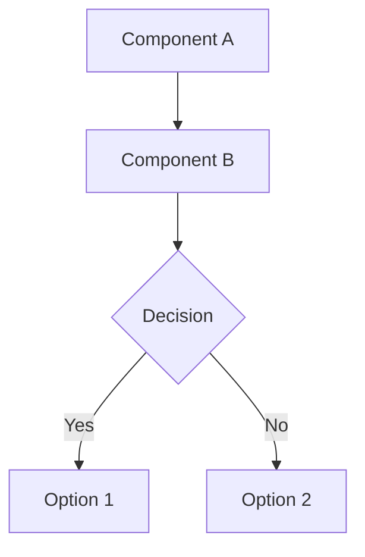

# Architecture & System Diagrams

This directory contains Mermaid diagrams documenting the Content Creation Studio architecture and multi-agent system.

## 📊 Main Diagrams

### [Architecture Diagram](architecture.mmd)

**File**: `architecture.mmd` (Mermaid format)

Complete system architecture showing:
- **User Interface**: Web Browser
- **Google Cloud Run**: Combined Frontend + Backend Service (Port 8080)
- **Vertex AI Agent Engine**: Master Orchestrator, Coordinators, Analyzers
- **Infrastructure**: Artifact Registry, Cloud Storage, Cloud Logging
- **AI Models**: Gemini 2.5 Flash via Vertex AI

**Components:**
- 🔵 Frontend: React 18 + Vite (static files)
- 🟢 Backend: FastAPI + Uvicorn (API server)
- 🟠 Agents: Master Orchestrator, Content Coordinator, Analyzer
- 🔴 AI: Google Gemini 2.5 Flash
- 🔷 Infrastructure: GCP services

### [Multi-Agent System Diagram](multi-agent-system.mmd)

**File**: `multi-agent-system.mmd` (Mermaid format)

Complete multi-agent workflow with 5 phases:

**Phase 1: Intake & Research** (Blue)
- Intake Agent: Parse content brief
- Topic Research Agent: Find trending topics

**Phase 2: Initial Draft** (Purple)
- Content Drafter Agent: Create initial draft

**Phase 3: Quality Loop** (Orange)
- Quality Checker Agent: Score content (threshold ≥70)
- Content Improver Agent: Refine content
- Max 3 iterations until quality threshold met

**Phase 4: Multi-Channel Generation** (Green - Parallel)
- Blog Post Writer: 800-1200 words, SEO optimized
- Social Media Creator: LinkedIn, Twitter, Instagram
- Email Newsletter Writer: Engaging emails with CTA
- SEO Metadata Agent: Meta tags, 5-10 keywords

**Phase 5: Packaging** (Pink)
- Final Packager Agent: Assemble complete deliverable

**Total Agents**: 12 specialized agents
**Workflow Type**: Sequential → Loop → Parallel → Sequential

## 🎨 Color Coding

### Architecture Diagram
- 🟦 **Cyan (#61dafb)**: Frontend components
- 🟩 **Teal (#009688)**: Backend components
- 🟧 **Orange (#ff6f00)**: Agent components
- 🟥 **Red (#ea4335)**: AI/ML models
- 🔷 **Blue (#4285f4)**: Cloud infrastructure

### Multi-Agent System Diagram
- 🟣 **Purple (#9c27b0)**: Orchestrator (thick border)
- 🟠 **Orange (#ff6f00)**: Coordinator (medium border)
- 🔵 **Light Blue (#e3f2fd)**: Phase 1 agents
- 🟣 **Light Purple (#f3e5f5)**: Phase 2 agents
- 🟡 **Light Orange (#fff3e0)**: Phase 3 agents (quality loop)
- 🟢 **Light Green (#e8f5e9)**: Phase 4 agents (parallel)
- 🔴 **Light Pink (#fce4ec)**: Phase 5 agents (packaging)
- 🟡 **Gold (#ffd700)**: Start/End points (thick border)

## 📖 How to Use

### GitHub/GitLab
Mermaid diagrams render automatically in `.mmd` files on GitHub and GitLab.

### VS Code
Install the [Mermaid Preview](https://marketplace.visualstudio.com/items?itemName=bierner.markdown-mermaid) extension to preview `.mmd` files.

### Mermaid Live Editor
1. Open [mermaid.live](https://mermaid.live/)
2. Copy the content from `.mmd` files
3. View, edit, and export diagrams

### In Documentation
Reference diagrams in markdown:
```markdown


```

## 🔗 Quick Links

| Diagram | File | Purpose |
|---------|------|---------|
| **Architecture** | [architecture.mmd](architecture.mmd) | System architecture |
| **Multi-Agent** | [multi-agent-system.mmd](multi-agent-system.mmd) | Agent workflow |
| **Visual Summary** | [VISUAL_SUMMARY.md](VISUAL_SUMMARY.md) | Quick reference |

## 📊 Diagram Statistics

| Diagram | Nodes | Connections | Phases | Complexity |
|---------|-------|-------------|---------|-----------|
| Architecture | 13 | 12 | 4 layers | Medium |
| Multi-Agent | 14 | 16 | 5 phases | High |

## 🛠️ Editing Diagrams

To modify diagrams:

1. **Open in editor**: Use VS Code with Mermaid extension
2. **Edit syntax**: Modify the Mermaid graph syntax
3. **Test rendering**: Preview in VS Code or mermaid.live
4. **Validate**: Ensure proper syntax and rendering
5. **Save**: Update the `.mmd` file

### Example Mermaid Syntax



## 📚 Additional Resources

- [Main README](../README.md) - Project overview
- [Visual Summary](VISUAL_SUMMARY.md) - One-page reference
- [Mermaid Documentation](https://mermaid.js.org/) - Syntax reference
- [Deployment Guide](../deployment/COMBINED_DEPLOYMENT.md) - Deployment instructions

## 💡 Tips

- **Color Consistency**: Use the same color scheme across diagrams
- **Clear Labels**: Include descriptive text in nodes
- **Logical Flow**: Arrange nodes top-to-bottom or left-to-right
- **Subgraphs**: Group related components
- **Class Definitions**: Use `classDef` for consistent styling
- **Comments**: Add comments with `%%` for documentation

## 🎯 Key Insights from Diagrams

### Architecture
- Single Cloud Run service hosts both frontend and backend
- RemoteRunner connects backend to Agent Engine
- All agents use Gemini 2.5 Flash model
- Infrastructure includes staging bucket and logging

### Multi-Agent System
- Master Orchestrator routes all requests
- Content Coordinator manages 5-phase pipeline
- Quality loop ensures score ≥70 (max 3 iterations)
- Phase 4 runs 4 agents in parallel for efficiency
- Final package includes blog, social, email, SEO content

---

**For detailed explanations and additional diagrams, see [VISUAL_SUMMARY.md](VISUAL_SUMMARY.md)**
